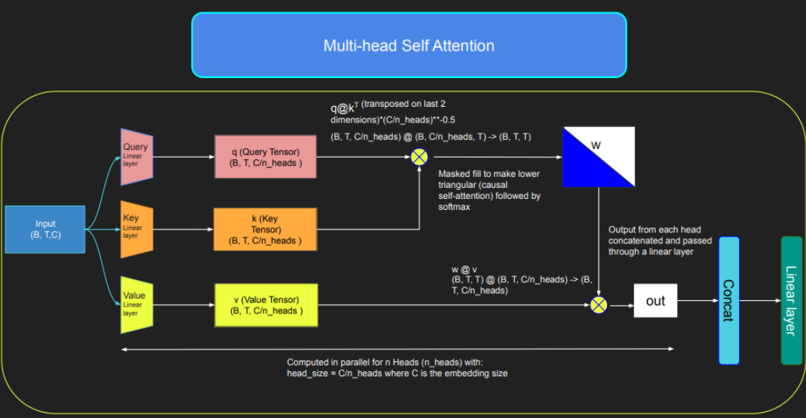
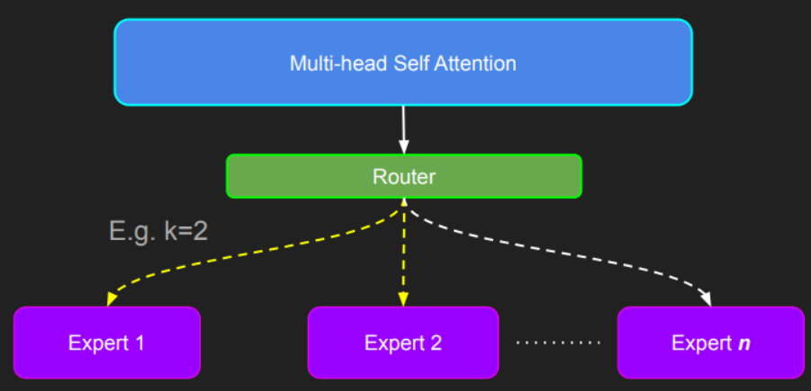
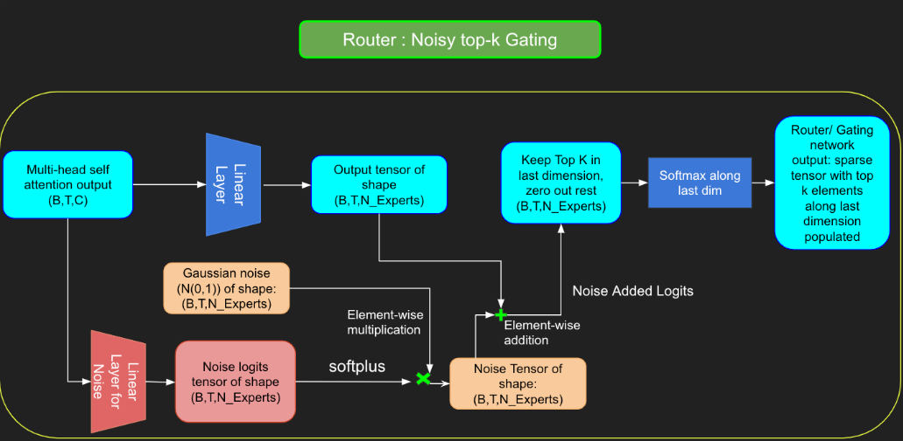

在 **Sparse Mix of Experts (MoE)** 架构中，每个 transformer block 内的自注意力机制保持不变。然而，每个块的结构都发生了变化：标准的前馈神经网络被几个稀疏激活的前馈网络所取代，称为专家。"稀疏激活"是指序列中的每个 token 仅路由到总可用池中有限数量的专家的过程。这有助于提高训练和推理速度，因为在每次向前传递中都会激活少数专家。

通过仅将前 k 个值保留在沿最后一个维度的相应索引中来获取稀疏门控输出。用 `-inf` 填充其余部分，并通过 softmax 激活，使前两个值更加突出。为了实现负载平衡，将 Noise 添加到门控线性层的 logit。

